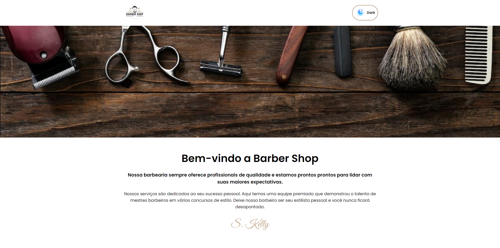
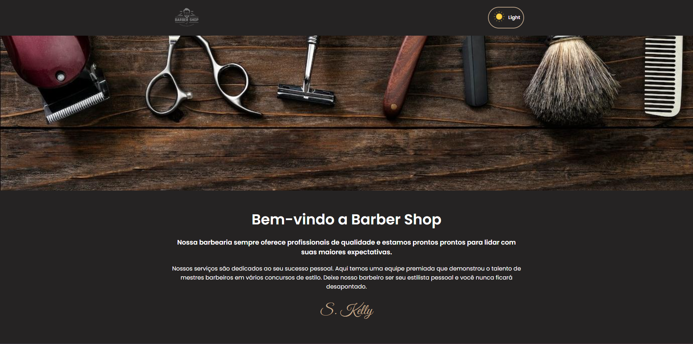

# Landing Page de uma barbearia em React JS

## Objetivo

A proposta desse projeto foi criar uma Landing Page de uma barbearia em React JS que possui a capacidade de alterar a cor do tema, ou seja, que possua um botão para alterar o tema de claro para escuro.

Dessa forma pude colocar em prática os seguintes conceitos:

- Criar uma funcionalidade que permite alterar o tema da página através da ação do usuário;
- Utilizar o State Hook para armazenar um valor booleano;
- Utilizar o operador IF ternário e criar condicionais para manusear classes CSS, imagens e textos no código React.

### Conhecendo o projeto

O projeto que será criado pode ser visto nas Figuras 1 e 2.

<figure>
  
  <figcaption align="center">
    Figura 1.
    
  Projeto que será criado (tema claro)</figcaption>
</figure>

<figure>
   
  <figcaption align="center">
    Figura 2.
    
  Projeto que será criado (tema escuro)</figcaption>
</figure>

Essa Landing Page está dividida em um **topo e duas seções**. Cada seção possui um tipo de informaçõa diferente.

#### Topo
- Logo;
- Botão para alterar o tema da página entre dark e light.

#### 1ª Seção
- Banner da barbearia.

#### 2ª Seção
- Informações da Barbearia.

### `npm start`

Para rodar o projeto no modo de desenvolvimento, execute o comando `npm start`.
Abra [http://localhost:3000](http://localhost:3000) para visualizá-lo em seu navegador.

### `deploy`

O deploy da aplicação foi realizado na plataforma [Vercel](https://vercel.com/).
E poderá ser acompanhado através do seguinte link: (https://barbearia-sage-nu.vercel.app/).